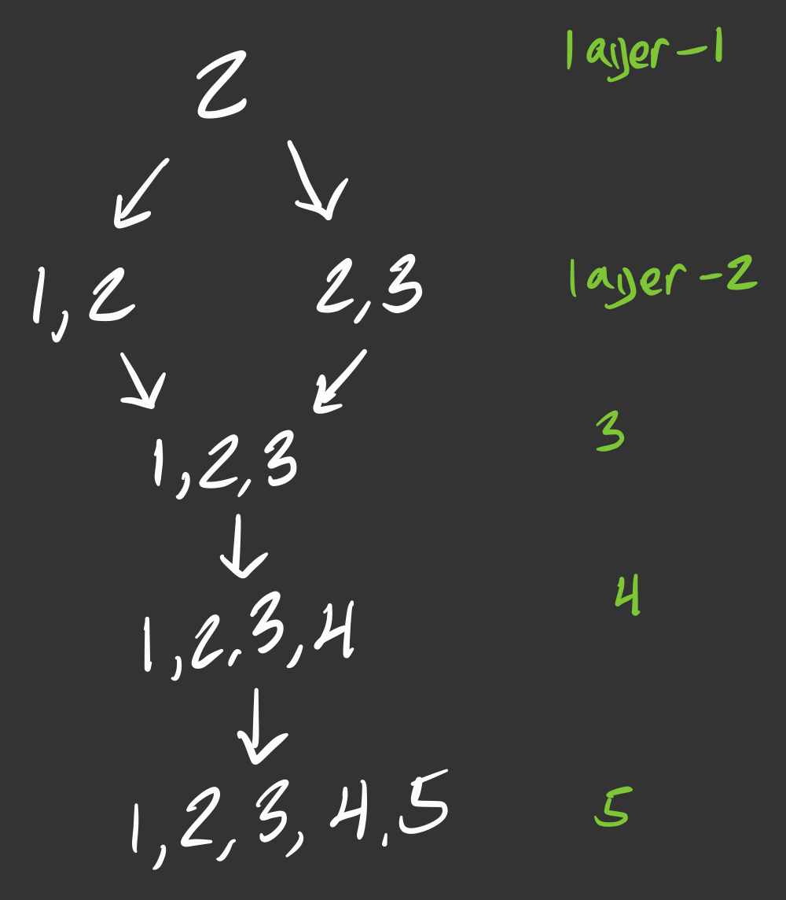
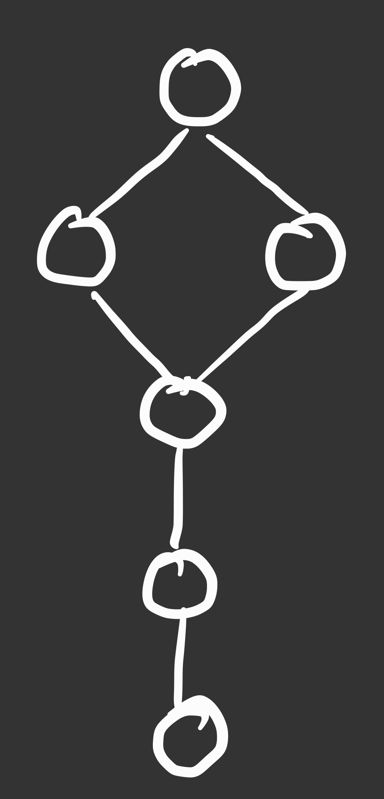
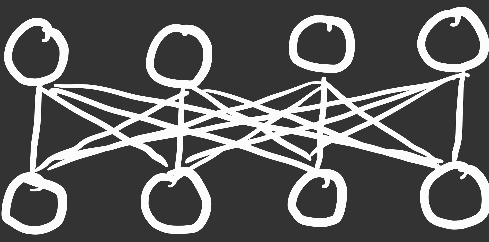
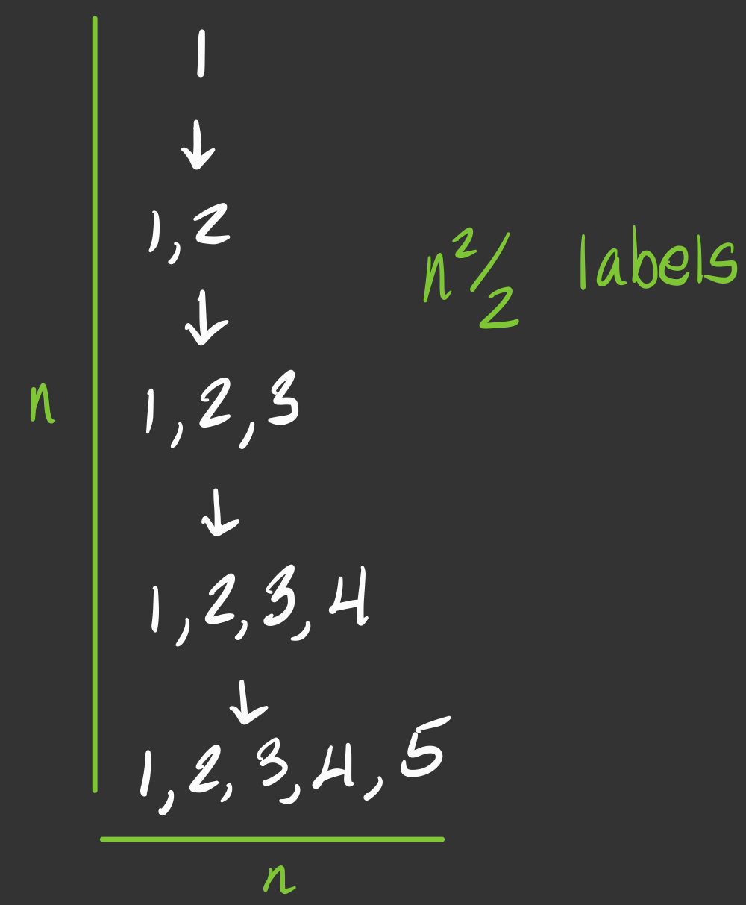

# Time & Space Complexity

I believe I have achieved the lowerbound runtime and space complexity.

**Time**: $O(n^2)$  
**Space**: $O(n^2)$  

## Undrstanding My Diagrams

Throughout my explanation I will make use of several graph diagrams that organize nodes by layer (amount of labels). For example given the graph,

```
2 -> 1 2
2 -> 2 3
1 2 -> 1 2 3
2 3 -> 1 2 3
1 2 3 -> 1 2 3 4
1 2 3 4 -> 1 2 3 4 5
```

I would draw the graph diagram as:



but, the direction of the edges can be implied from the layer because nodes with less labels always point to nodes with more labels. And, often the structure of the graph is more important than the arbitrary node contents. So it can be simplified further...



## Lowerbound Runtime

**Worst case graph**

A worst case set of nodes is one that maximizes the amount of edges in the solution. It would not be disjoint because a connected graph has more edges. Note that it is valid for every layer to draw an edge to every node in the next layer. The worst case graph would include this. The amount of these edges between those two layers in this case would be $|layer_1| \cdot |layer_2|$. This expression is maximized with larger layers and so the worst case graph maximizes edges by maximizing the size of the layers and minimzing the amount of layers.



The amount of edges are given by $\lfloor n/2 \rfloor \lceil n/2 \rceil \approx n^2/4$.  
$O(n^2)$ amount of edges.

In this scenario, all edges can be present in the solution, or not. That is, removing any edge, or even every edge, yields a valid solution. In order not to confuse permutations of the solution, the most efficient algorithm would need to confirm if every edge exists in the solution necessarily.

In other words, the fastest algorithm that produces every correct edge will run in proportion to the size of the solution it produces. $O(n^2)$ means such an algorithm is running exponentially in the quantity of nodes, but linear in the quantity of edges.

## Lowerbound space

It may be possible to achieve a space complexity lower than mine ($O(n^2)$). I am not definitive on this lowerbound. It may be possible to exceed my algorithm if it could keep all nodes in a file and produce the solution without ever having the entire solution or input nodes in memory at once.

However, it is necesarily the case that any function that takes in all nodes as a parameter must execute with $O(n^2)$ space because the node labels are $n^2$ in nature.

Consider a graph where all nodes lie in a linear lineage:



At the worst case, the labels of the node include the labels of their ancestors which brings the overall space complexity to store $n$ nodes $O(n^2)$.

Overall, we have a problem that takes $O(n^2)$ information as an input and produces $O(n^2)$ information as an output. Reducing space complexity from $O(n^2)$ would require computing the solution without keeping the nodes or the edges in memory.

I consider such an algorithm very unlikely to exist. Especially because every solution exists as a subset lattice with "missing nodes". A solution with 720 symbols could have at worst $2^{720}$ nodes, but the runtime can remain at $n^2$ because it isn't necessary to scan the entire possible solution space, only the nodes given. I personally believe this implies that reducing space complexity further would require a very large cost in runtime.